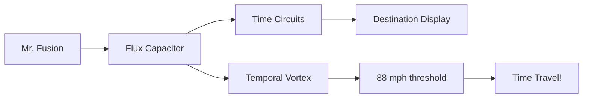

DeLorean DMC-12 con conversión para viaje temporal. Carrocería de acero inoxidable,
puertas de ala de gaviota. Modificado por el Dr. Brown para albergar el condensador
de flujo. Requiere **88 mph** para activar el viaje. Ha viajado a **1955**, **2015**, **1885**
y de vuelta.

## Especificaciones técnicas

```typescript
interface TimeMachineSpec {
  model: "DMC-12"
  year: 1981
  maxSpeed: 88 // mph
  powerRequired: 1.21 // GW
  fuelSources: ["plutonium", "lightning", "mr_fusion"]
  modifications: ["flux-capacitor", "time-circuits", "mr-fusion"]
}
```


