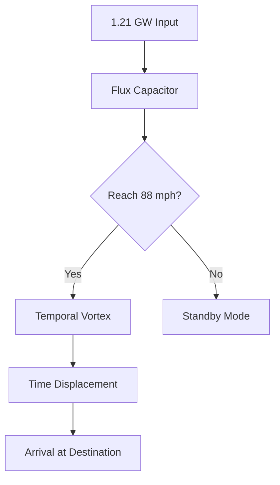

El **condensador de flujo** es el dispositivo que hace posible el viaje temporal.
Consiste en tres luces intermitentes dispuestas en una configuración de flujo
que genera un vórtice temporal cuando el vehículo alcanza **88 mph** y recibe
**1.21 gigawatts** de potencia.

> "El condensador de flujo es lo que hace posible el viaje temporal." — Dr. Emmett Brown

## Diagrama de funcionamiento

