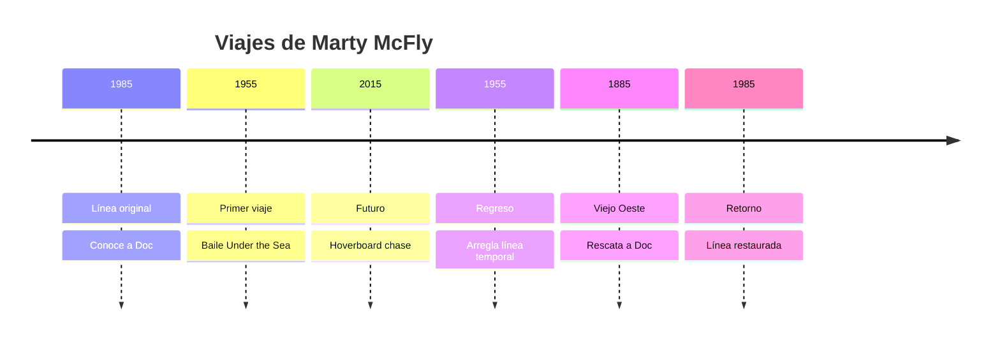

Marty McFly es el protagonista de los viajes temporales. Adolescente de **Hill Valley**,
toca la guitarra, odia que lo llamen **"gallina"**, y ha salvado la línea temporal
en al menos **tres ocasiones** documentadas.

## Habilidades

| Habilidad | Nivel (1-10) | Notas |
|-----------|:---:|-------|
| Guitarra | 9 | Interpretó *Johnny B. Goode* en 1955 |
| Hoverboard | 9 | Escapó de Griff Tannen en 2015 |
| Pilotaje temporal | 8 | Viajó a 1955, 2015, 1885 |
| Supervivencia | 7 | Sobrevivió al Viejo Oeste |

## Línea de viajes temporales

